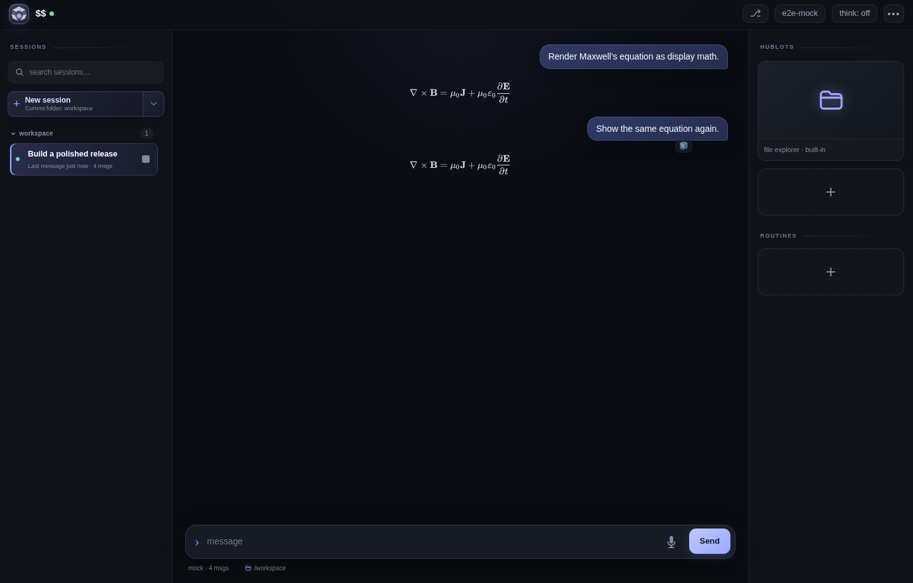
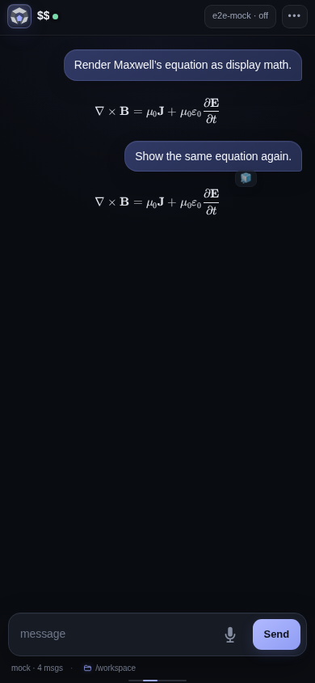

<h1 align="center"> Oyster</h1>

  Run the <a href="https://github.com/badlogic/pi-mono">pi coding agent</a> from any browser.

  
  
  

  

Oyster is a responsive web workspace for pi. Follow agent sessions in real time, inspect tool calls, move between projects, manage files, and keep long-running work within reach from desktop or mobile.

## Highlights

- **Live sessions** — streamed Markdown, math, thinking, tool calls, and partial output.
- **Session history** — search, resume, fork, archive, and switch between conversations.
- **Workspace access** — browse, edit, and download files without leaving the app.
- **Routines** — run repeatable jobs with live progress and teardown controls.
- **Hublots** — expose agent-built local interfaces through managed tunnels.
- **Credentials** — use pi-native API key and OAuth storage without sending secrets to the browser.
- **Made for mobile** — steer an active agent, review work, and manage sessions from your phone.

  

  <a href="docs/getting-started/installation.md"><strong>Get started</strong></a>
  · <a href="docs/readme.md">Documentation</a>
  · <a href="docs/getting-started/security.md">Security</a>
  · <a href="CONTRIBUTING.md">Contributing</a>

