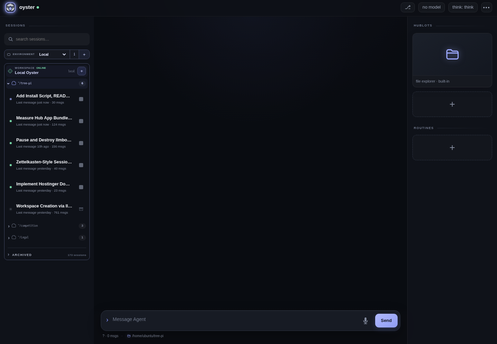
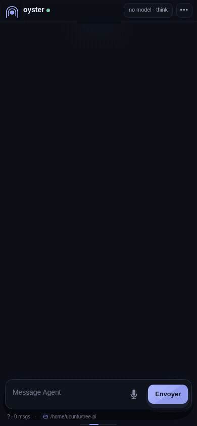

<h1 align="center"> Oyster</h1>

<p align="center">
  Generalist work agents, available from any browser.
</p>

<p align="center">
  <a href="https://github.com/SergeiKireevDev/oyster/actions/workflows/ci.yml"></a>
  
  <a href="LICENSE"></a>
</p>

<p align="center">
  
</p>

Oyster is a responsive web workspace for the [pi coding agent](https://github.com/badlogic/pi-mono). Follow agent sessions in real time, inspect tool calls, move between projects, manage files, and keep long-running work within reach from desktop or mobile.

## Philosophy

- **Mobile first.** Oyster is designed for starting, steering, and reviewing real work from a phone—not merely shrinking a desktop chat UI.
- **Generalist work agents.** Agents get a persistent workspace, files, a shell, routines, and shareable interfaces so they can carry a task from research through implementation and operation.
- **Security through isolation.** Tool-using agents execute untrusted code and should not share a host with sensitive workloads. Production workspaces belong in dedicated VMs or hardware-isolated microVMs, with scoped credentials and network access. A standalone Oyster install has the permissions of its Unix user, so run it inside a dedicated VM; Oyster Hub can provision a separate cloud VM or llmbox microVM for each workspace.

## Get started on a server

The installer targets a fresh **Debian or Ubuntu** server on amd64 or arm64. Use a non-root deployment user with `sudo`, and run the server itself in a dedicated VM.

```bash
sudo apt-get update && sudo apt-get install -y git ca-certificates
git clone --recurse-submodules https://github.com/SergeiKireevDev/oyster.git
cd oyster
./scripts/install.sh
```

The idempotent installer:

1. installs Git, build tools, Node.js 22 when needed, and `cloudflared` for hublots;
2. initializes the bundled pi source and installs both lockfiles independently;
3. builds pi and the Oyster UI, then runs the full test suite;
4. registers Oyster's pi extensions and creates `~/oyster-workspace`;
5. generates `.ui-token` with owner-only permissions; and
6. enables a persistent `pi-ui.service` systemd user service on `127.0.0.1:8080`.

Verify the local service:

```bash
curl --fail http://127.0.0.1:8080/health
systemctl --user status pi-ui.service
journalctl --user -u pi-ui.service -f
```

### Add secure remote access

Oyster can run tools, edit files, and manage credentials. Treat access like shell access. **Never publish port 8080 directly**: the bearer token authenticates requests but does not encrypt them.

1. Point a DNS name at the server.
2. Terminate valid HTTPS with Caddy, nginx, Cloudflare Tunnel, or another trusted reverse proxy.
3. Proxy to `http://127.0.0.1:8080`, preserving streaming and WebSocket connections. For example, a Caddy site is:

   ```caddyfile
   oyster.example.com {
       reverse_proxy 127.0.0.1:8080
   }
   ```

4. Keep TCP 8080 closed in the host and cloud firewalls.
5. Read the token locally with `cat .ui-token`, then open:

   ```text
   https://oyster.example.com/#token=<TOKEN>
   ```

   The fragment is captured locally and removed from the address bar. Do not put the token in query strings, logs, screenshots, or issue reports.
6. Open the credentials panel in Oyster and connect an LLM provider using pi's API-key or OAuth flow.

Installer options and deployment paths:

```bash
./scripts/install.sh --help       # options and environment overrides
git pull --ff-only && ./scripts/install.sh  # update and restart safely
```

See [Installation](docs/getting-started/installation.md), [Configuration](docs/getting-started/configuration.md), [Security](docs/getting-started/security.md), and [container deployment](docs/operations/containers.md) for manual and advanced setups.

## Highlights

- **Live sessions** — streamed Markdown, math, thinking, tool calls, and partial output.
- **Session history** — search, resume, fork, archive, and switch between conversations.
- **Workspace access** — browse, edit, and download files without leaving the app.
- **Routines** — run repeatable jobs with live progress and teardown controls.
- **Hublots** — expose agent-built local interfaces through managed tunnels.
- **Credentials** — use pi-native API key and OAuth storage without sending secrets to the browser.
- **Made for mobile** — steer an active agent, review work, and manage sessions from your phone.

<p align="center">
  
</p>

<p align="center">
  <a href="docs/readme.md">Documentation</a>
  · <a href="docs/getting-started/security.md">Security</a>
  · <a href="CONTRIBUTING.md">Contributing</a>
</p>
